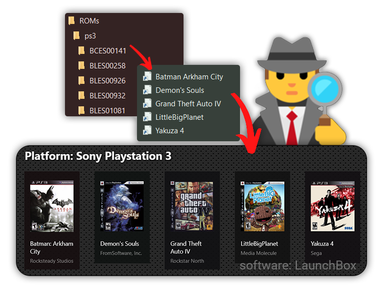

<div align="center">
<h1>🕵️ Rom Detective 🕹️</h1>


<a href="https://github.com/sondregronas/Rom-Detective/"></a>
<a href="https://github.com/sondregronas/Rom-Detective/commit/"></a>

<a href="https://codecov.io/gh/sondregronas/Rom-Detective" ></a>
<a href="https://www.buymeacoffee.com/u92RMis"></a>

<br>

A tool to automatically *index* ROMs and create shortcuts to them. Allowing you to physically store your ROMs wherever you'd like, while still treating them like individual ROMs for launchers like LaunchBox.

**For now this works for my personal needs, but it's by no means user-friendly yet.**
</div>

## How
The application only works on Windows. The destination drive must be formatted to support symlinks for ROMs (NTFS or UDF, see https://docs.microsoft.com/en-us/windows/win32/fileio/filesystem-functionality-comparison)

There's currently no intuitive way to run the script (a GUI is in the works) other than to hardcode the ROMs location inside of `main.py`.
ROMs are linked with symlinks which may require admin privileges to run.

## What
ROMs or Games are indexed as a `IndexerItem` dataclass:
```python
@dataclass
class IndexerItem:
    source: str # Path to original ROM or Game file/executable
    platform: Platform # Global variable PLATFORMS[<platform_id>] (PLATFORMS['n64'])
    filename: str # Does some re-formatting and searching, but it's not an indexer for all ROM types.
```

`IndexerItem` has different subclasses for certain ROM or game types to automatically fetch the correct ROM file and metadata:
```python
PS3IndexItem(IndexerItem) # Targets <folder>\PS3_GAME\USRDIR\EBOOT.BIN and gets title from a database
WiiUIndexItem(IndexerItem) # Reads a meta.xml for any given *.rpx file, also blacklists DLC or Update directories
SteamLibraryIndexItem(IndexerItem) # Reads libraryfolders.vdf in primary steam installation folder and gets installed games (blacklists software)
```

`Platform` is derived from `data/platforms.yaml`.

`util_index.py` holds the different methods for indexing items.

A function `create_shortcut(IndexerItem)` creates either a symlink, or a shortcut, to a target destination (Default: `%homepath%/ROMs/<platform>`)

## Why?
In order to more easily update the library inside an emulation launcher (such as LaunchBox),
proper naming schemes & file structure is key for good results, but not always permitted depending on the ROM type.

Some ROMs require specific naming schemes to work at all, such as Playstation 3's `EBOOT.BIN` ROMs.
By creating a shortcut to `EBOOT.BIN` using the proper game title as the filename will however allow LaunchBox to interpret the ROM correctly.

This also allows LaunchBox to watch for added/removed ROMs, without physically having to move the ROM files, meaning they can be stored wherever without losing that benefit.

## Setup Python:
Modify `main.py` to fit your needs.
```bash
pip install -r requirements.txt
python main.py
:: OR
run.bat
```
To build the application, simply run
```bash
pyinstaller main.spec
```

Note: if your files are stored on a NAS and you're running as admin, make sure the system user on your PC has access to the network drives (see `run.bat`). (This won't be a problem when a GUI is in place)

## TO-DO:
- Add a GUI / config file
- Complete platforms / default extensions in `src/const.py`
- Try to circumvent needing admin privileges (regular shortcuts don't work with most emulators, symlinks do)
- Watch for new/deleted ROMs & update automatically (compare log to console)
