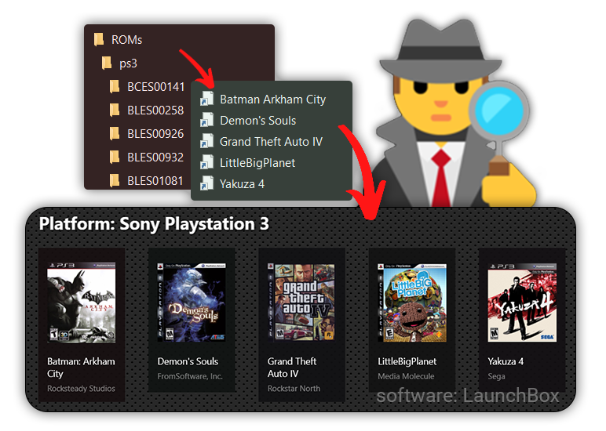

<div align="center">
<h1>🕵️ Rom Detective 🕹️</h1>


<a href="https://github.com/sondregronas/Rom-Detective/"></a>
<a href="https://github.com/sondregronas/Rom-Detective/commit/"></a>

<a href="https://codecov.io/gh/sondregronas/Rom-Detective"></a>

<br>

A tool to automatically *index* ROMs and create shortcuts to them. Allowing you to physically store your ROMs wherever you'd like, while still treating them like individual ROMs for launchers like LaunchBox.
</div>

## How
The application only works on Windows. The destination drive must be formatted to support symlinks for ROMs (NTFS or UDF, see https://docs.microsoft.com/en-us/windows/win32/fileio/filesystem-functionality-comparison)

Your system must either have [Developer Mode enabled](https://blogs.windows.com/windowsdeveloper/2016/12/02/symlinks-windows-10/) or the application must be run as admin.
If your files are stored on a NAS and you're running as admin, make sure the system user has access to the network drives.

### Setup
The binary can be downloaded <a href="https://github.com/sondregronas/Rom-Detective/releases">here</a>, create a folder for it and just plonk it in.

Add your ROM folder (or individual folders) and hit "Create Shortcuts" - and you're off to the races


For RPCS3 & LaunchBox you need to remove the emulator from the ROMs, so it will launch the generated .bat file instead. (This is a limitation of RPCS3 only looking for game data where the symlink is, and not the actual EBOOT.BIN)

## Why?
In order to more easily update the library inside an emulation launcher (such as LaunchBox),
proper naming schemes & file structure is key for good results, but not always permitted depending on the ROM type.

Some ROMs require specific naming schemes to work at all, such as Playstation 3's `EBOOT.BIN` ROMs.
By creating a shortcut to `EBOOT.BIN` using the proper game title as the filename will however allow LaunchBox to interpret the ROM correctly.

This also allows LaunchBox to watch for added/removed ROMs, without physically having to move the ROM files, meaning they can be stored wherever without losing that benefit.

## Development
Running from python
```bash
pip install -r requirements.txt
python src/main.py
```

The binary can be built using
```bash
pyinstaller main.spec
```

### Classes
ROMs or Games are indexed as an `Item` dataclass object:
```python
@dataclass
class Item:
    source: str  # Path to original ROM or Game file/executable
    platform: Platform  # Global variable PLATFORMS[<platform_id>] (PLATFORMS['n64'])
    filename: str  # Does some re-formatting and searching, but it's not an indexer for all ROM types.
    title: str  # Same as filename, but without an extension
    extension: str  # Just the file extension (.url generates internet shortcuts)
```

Different subclasses are used for some ROM or game types to automatically fetch the correct ROM file and metadata:
```python
PS3Item(Item)  # Targets <folder>\PS3_GAME\USRDIR\EBOOT.BIN and gets title from a database
WiiUItem(Item)  # Reads a meta.xml for any given *.rpx file, also blacklists DLC or Update directories
SteamItem(Item)  # Reads libraryfolders.vdf in primary steam installation folder and gets installed games (blacklists software)
```

`Platform` objects get derived from `src/data/platforms.yaml`.

## TO-DO:
- Complete platforms / default extensions in `src/data/`
- Add more sources
- Tidy up UI, write tests
- Watch for new/deleted ROMs & update automatically (compare log to console)
- Move logs to appdata?
